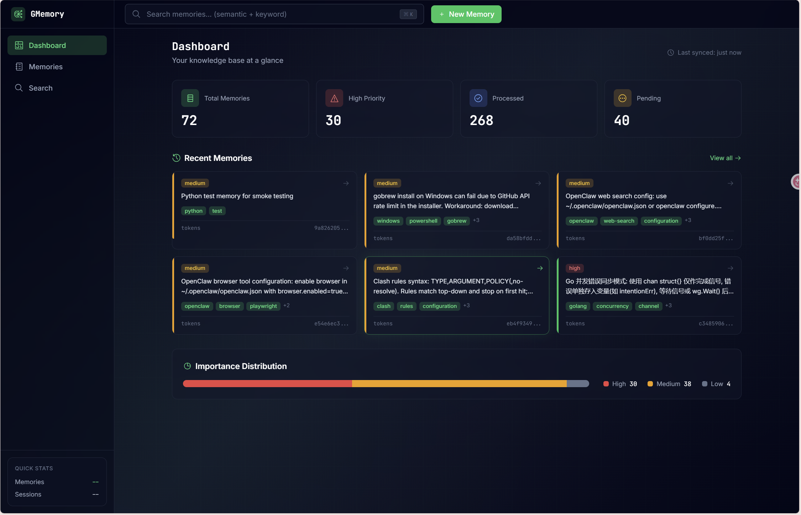
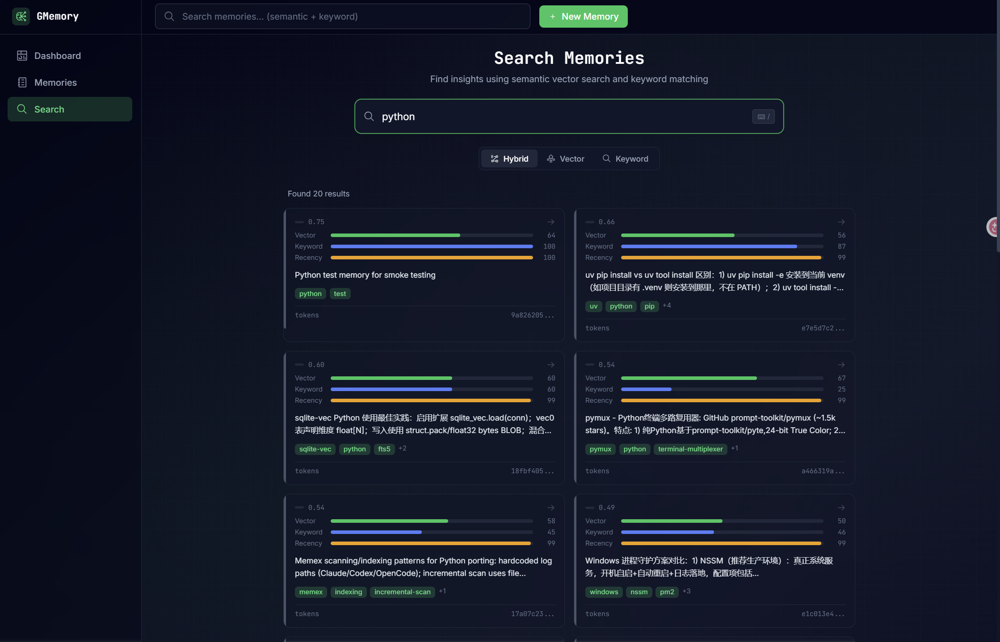

# GMemory

[](https://www.python.org/downloads/)
[](https://opensource.org/licenses/MIT)
[]()

**GMemory 是给 AI coding agents 用的本地记忆引擎：快、准、可控。**

它把会话沉淀为可检索知识，把你的 agent 从“每次重来”升级成“持续进化”。

## 产品亮点

- **Hybrid Search**：`sqlite-vec` + `FTS5` 融合检索，语义和关键词同时命中。
- **Local First**：数据本地存储，本地 embeddings，无需外部向量服务。
- **Agent Workflow Native**：天然适配 `fetch -> process/save -> mark` 记忆工作流。
- **CLI + MCP + Web**：同一套能力覆盖命令行、MCP 工具调用和可视化管理。
- **Production-minded**：支持备份还原、增量扫描、去重、健康检查与维护命令。

## 界面预览

<div align="center">
  
  <br/>
  
  
</div>

## 一句话定位

**不是聊天记录存档，而是 Agent 的“长期记忆层”。**

## 快速开始

```bash
# 1) 启动处理流程
gmemory process --limit=5

# 2) 保存提炼记忆
gmemory save --session-id=<id> --content="Key insight" --preview="Short summary" --tags="python,api"

# 3) 检索
gmemory search "authentication pattern" --compact
```

## 文档导航

- 详细安装、命令、配置、维护说明：`docs/README_DETAILS.md`
- 中文版完整说明：`README_CN.md`
- Web 子项目说明：`web/README.md`

## License

MIT
